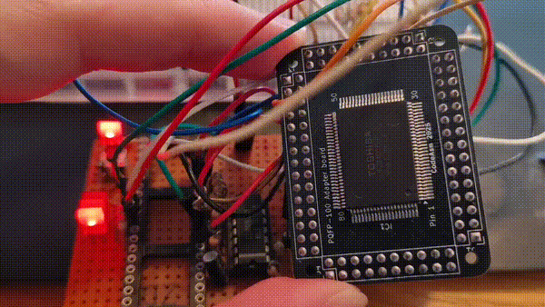
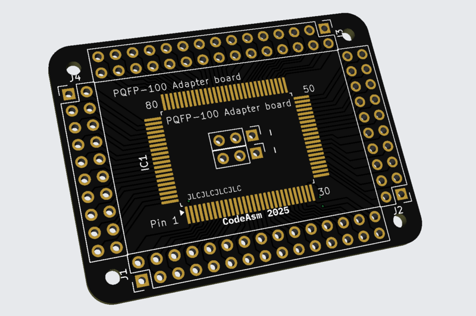

# PQFP-100 Adapter Board

This project is for a PQFP-100 adapter board designed using KiCad version 9.

in the release folder you may find a zip folder of the board gerbers ive send to production,
a schematic and board overview in pdf format.

Here is an example use, but should work for most pqfp-100 chips (unless the pitch or pin size is way different)

 * [A test print pdf of the board (PDF)](release/PQFP100-Prototype_board.pdf)
 * [The schematic (PDF)](release/PQFP100-Prototype_schematics.pdf)
 * [Gerber files in zip, ready for production (ZIP)](release/PQFP100-Prototype_rev3.zip)

## Succesfull tests

As can be seen at the top of this readme, the below board has been produced at jlcpcb and the z80 ic functions.
Below here you can see what it would look like in the 3d viewer. Its not specific to this ic, the pinout is one to one, 100 to 100.

## Contributing

Feel free to fork the repository and submit pull requests. For major changes, please open an issue first to discuss what you would like to change.

## Attribution

Id like to thank the following:

- [Z80 common ic symbols and footprints KiCAD by flypie](https://github.com/flypie/Z80-CPU-for-KiCAD) I used their footprint and adjusted it.
- [KiCad 6: Change Track Width](https://www.youtube.com/watch?v=eDhIbKeDssM) I was wondering something, then discovered i used too small pitched headers instead of needing smaller traces. still helpfull.

## License

This project would be licensed under the MIT License.
